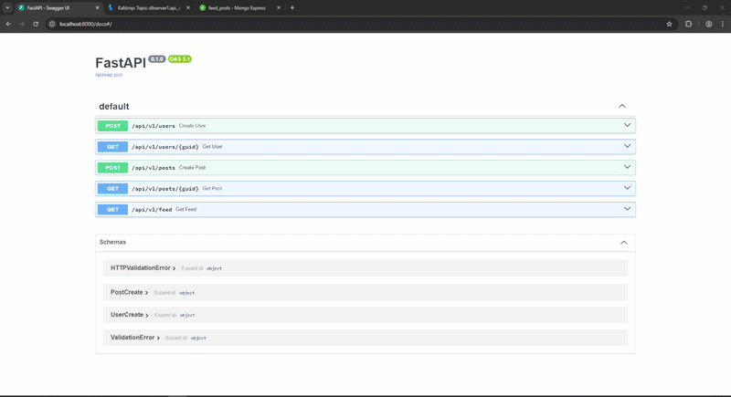
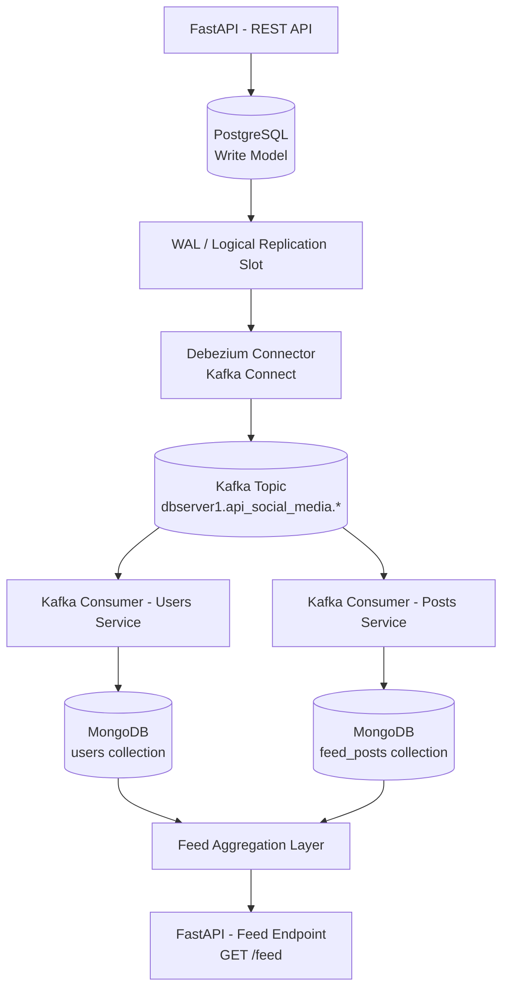

<div align="center">
    <h1>CDC Kafka + Debezium | Social Media API (Event-Driven Architecture)</h1>
      
      
      
      
      
      
      
</div>
<div align="center">
    
</div>

<br>

Este projeto é uma simulação de uma <strong>rede social 100% baseada em API</strong>, construída com foco em <strong>arquitetura orientada a eventos</strong>, utilizando:

- PostgreSQL (write model)
- Debezium (CDC)
- Kafka (streaming de eventos)
- Consumers Python (processamento)
- MongoDB (read model)
- FastAPI (API REST)

<p align="center">
    
</p>

<br>

# 🧠 Visão geral

A ideia central do projeto é demonstrar um fluxo real de **Change Data Capture (CDC)** aplicado a um cenário de rede social.



<br>

# 🎯 Objetivo do projeto

Este projeto foi criado com foco em:

- demonstrar CDC na prática
- arquitetura orientada a eventos (Event-Driven)
- separação de write/read models (CQRS)
- integração entre bancos relacionais e NoSQL
- pipelines de dados em tempo real

<br>

# 🏗️ Arquitetura

O sistema é dividido em 4 camadas principais:

## 1. Write Model

- PostgreSQL
- garante consistência e integridade

## 2. Event Streaming

- Debezium + Kafka
- captura mudanças automaticamente

## 3. Processamento

- Consumers Python
- enriquecimento de dados
- materialização de read models

## 4. Read Model

- MongoDB
- otimizado para leitura de feed

<br>

# 📦 Funcionalidades

## 👤 Usuários

- criar usuário
- buscar usuário por GUID

## 📝 Posts

- criar post
- buscar post por GUID

## 📡 Feed

- listar últimos posts
- dados enriquecidos com usuário

<br>

# ⚙️ Stack utilizada

- FastAPI
- PostgreSQL
- Kafka
- Kafka Connect
- Debezium
- MongoDB
- Python
- Docker Compose

<br>

# 🌐 Serviços disponíveis

| Serviço | URL |
|---|---|
| API Swagger | http://localhost:8000/docs |
| Kafka UI (Kafdrop) | http://localhost:9000 |
| Kafka Connect | http://localhost:8083 |
| Mongo Express | http://localhost:8081 |

<br>

# 🧭 Sumário da documentação (/docs)

Abaixo está a documentação completa do projeto:

## 📘 Setup

📄 [`docs/setup.md`](docs/setup.md)

- como subir o ambiente
- execução da API
- execução de consumers
- validação do CDC

## 🧠 Arquitetura

📄 [`docs/architecture.md`](docs/architecture.md)

- visão geral do sistema
- componentes
- fluxo de dados
- CQRS simplificado

## 🔄 Fluxo CDC

📄 [`docs/cdc-flow.md`](docs/cdc-flow.md)

- funcionamento do Debezium
- publicação no Kafka
- estrutura de eventos
- logical replication

## 🧵 Consumers

📄 [`docs/consumers.md`](docs/consumers.md)

- users_consumer
- posts_consumer
- enrichment
- idempotência
- tratamento de eventos

## 🗄️ Read Model (MongoDB)

📄 [`docs/mongodb-read-model.md`](docs/mongodb-read-model.md)

- modelagem de feed
- enriquecimento de dados
- CQRS na prática
- performance de leitura

## ⚡ Stress Test

📄 [`docs/stress-test.md`](docs/stress-test.md)

- geração massiva de dados
- paralelismo
- throughput da pipeline
- validação de CDC em escala

## 🧪 Troubleshooting

📄 [`docs/troubleshooting.md`](docs/troubleshooting.md)

- problemas comuns
- Kafka sem mensagens
- Debezium não funcionando
- Mongo vazio
- erros de conexão

## 🧾 Decisões Arquiteturais

📄 [`docs/decisions.md`](docs/decisions.md)

- escolhas técnicas
- trade-offs
- CQRS simplificado
- uso de MongoDB
- uso de CDC

## 🛣️ Roadmap

📄 [`docs/roadmap.md`](docs/roadmap.md)

- melhorias futuras
- evolução do sistema
- features planejadas
- escalabilidade

## 📡 API

📄 [`docs/api.md`](docs/api.md)

- endpoints
- contratos
- feed
- users
- posts

<br>

# 🧪 Exemplo de fluxo completo

## 1. Criar usuário

```http
POST /users
```

## 2. Criar post

```http
POST /posts
```

## 3. CDC automático

```text
PostgreSQL → Debezium → Kafka
```

## 4. Consumer processa

```text
Kafka → Consumer → MongoDB
```

## 5. Consultar feed

```http
GET /feed
```

<br>

# 📊 Diferencial do projeto

Este projeto demonstra:

- arquitetura real de streaming de eventos
- CDC em tempo real
- separação de read/write models
- processamento assíncrono
- materialização de dados
- integração de múltiplos sistemas

<br>

# 🧠 Conceitos aplicados

- Change Data Capture (CDC)
- Event-Driven Architecture
- CQRS
- Event Streaming
- Data Materialization
- Logical Replication

<br>

# 🔥 Possíveis evoluções

- likes e comentários
- feed personalizado
- Redis cache
- Elasticsearch
- analytics em tempo real
- DLQ (Dead Letter Queue)
- observabilidade (Prometheus + Grafana)
- autenticação JWT

(:
