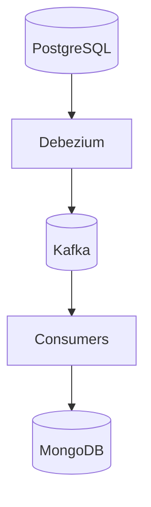
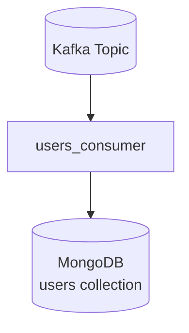
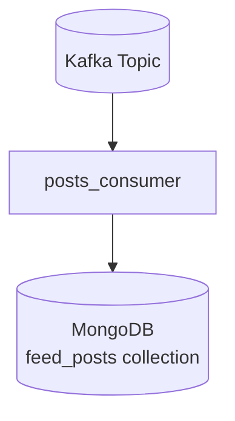

# Consumers

Este documento descreve os consumers Kafka implementados no projeto, suas responsabilidades e o papel de cada um na pipeline CDC.

---

# Objetivo

Os consumers são responsáveis por:

- consumir eventos CDC do Kafka
- interpretar payloads do Debezium
- processar alterações
- materializar read models
- enriquecer documentos
- sincronizar o MongoDB

---

# Papel dos consumers na arquitetura



Os consumers representam a camada de processamento assíncrono da aplicação.

---

# Estratégia utilizada

Cada entidade relevante possui um tópico Kafka dedicado:

| Entidade | Tópico Kafka |
|---|---|
| users | dbserver1.api_social_media.users |
| posts | dbserver1.api_social_media.posts |

Cada tópico pode possuir um consumer específico.

---

# Consumers implementados

| Consumer | Responsabilidade |
|---|---|
| users_consumer.py | Sincronização de usuários |
| posts_consumer.py | Materialização do feed |

---

# users_consumer.py

Responsável por sincronizar usuários no MongoDB.

---

# Fluxo



---

# Responsabilidades

- consumir eventos CDC de usuários
- tratar INSERT/UPDATE/DELETE
- manter coleção sincronizada

---

# Tópico consumido

```text
dbserver1.api_social_media.users
```

---

# Exemplo simplificado

```python
consumer = KafkaConsumer(
    'dbserver1.api_social_media.users',
    bootstrap_servers='localhost:29092'
)
```

---

# Exemplo de documento

```json
{
  "_id": 1,
  "guid": "user-guid",
  "nome": "Felipe",
  "email": "felipe@email.com"
}
```

---

# posts_consumer.py

Responsável por materializar o feed da aplicação.

---

# Fluxo



---

# Responsabilidades

- consumir eventos CDC de posts
- realizar enrichment
- construir read model otimizado
- persistir documentos enriquecidos

---

# Tópico consumido

```text
dbserver1.api_social_media.posts
```

---

# Enrichment

O consumer consulta a coleção de usuários para enriquecer os posts.

---

# Exemplo

## Evento original

```json
{
  "id": 1,
  "content": "Meu post",
  "id_user": 1
}
```

---

## Documento enriquecido

```json
{
  "_id": 1,
  "guid": "post-guid",
  "content": "Meu post",
  "user": {
    "guid": "user-guid",
    "nome": "Felipe"
  }
}
```

---

# Benefícios do enrichment

## Feed otimizado

A API evita joins em tempo real.

---

## Menor acoplamento

A leitura não depende do PostgreSQL.

---

## Melhor performance

MongoDB retorna documentos prontos para consumo.

---

# Tratamento de operações CDC

Os consumers interpretam o campo:

```json
"op"
```

---

# Operações suportadas

| Operação | Descrição |
|---|---|
| c | create |
| u | update |
| d | delete |
| r | snapshot/read |

---

# CREATE

Inserção de documento:

```python
collection.update_one(
    {"_id": doc["_id"]},
    {"$set": doc},
    upsert=True
)
```

---

# UPDATE

Atualização do documento existente.

---

# DELETE

Remoção do documento:

```python
collection.delete_one(
    {"_id": id}
)
```

---

# Idempotência

Os consumers utilizam:

```python
upsert=True
```

para garantir comportamento idempotente.

Isso evita duplicidade durante reprocessamentos.

---

# Tombstones

O Debezium pode gerar eventos null.

Os consumers validam:

```python
if payload is None:
    continue
```

para evitar falhas.

---

# Logs

Os consumers utilizam logging para observabilidade.

Exemplo:

```python
logging.info(
    f"Document created: {id}"
)
```

---

# Escalabilidade

A arquitetura permite:

- múltiplos consumers
- múltiplos grupos
- paralelismo
- processamento independente

---

# Possíveis novos consumers

A arquitetura suporta facilmente novos processamentos.

Exemplos:

| Consumer | Objetivo |
|---|---|
| analytics_consumer | métricas |
| notifications_consumer | notificações |
| cache_consumer | Redis |
| search_consumer | Elasticsearch |
| metrics_consumer | observabilidade |

---

# Estratégias futuras

## Retry

Implementar retry em falhas temporárias.

---

## DLQ

Mensagens inválidas podem ser enviadas para Dead Letter Queue.

---

## Async Processing

Uso de asyncio para maior throughput.

---

## Batch Processing

Persistência em lote no MongoDB.

---

# Throughput

O projeto inclui scripts de geração massiva de dados para:

- stress tests
- validação de throughput
- testes de propagação CDC

---

# Observabilidade

Os eventos podem ser acompanhados via:

## Kafdrop

```text
http://localhost:9000
```

---

## Mongo Express

```text
http://localhost:8081
```

---

# Benefícios da abordagem

## Desacoplamento

API e processamento assíncrono são independentes.

---

## Extensibilidade

Novos fluxos podem ser adicionados sem alterar a API.

---

## Reprocessamento

Eventos podem ser reconsumidos a qualquer momento.

---

## Escalabilidade

Consumers podem ser distribuídos horizontalmente.

---

# Conclusão

Os consumers representam o núcleo do processamento assíncrono da aplicação.

Eles demonstram:

- integração com Kafka
- processamento CDC
- materialização de read models
- enrichment
- arquitetura orientada a eventos
- pipelines assíncronas modernas