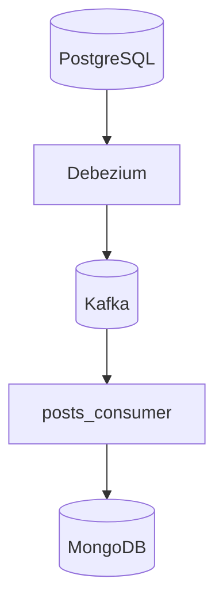
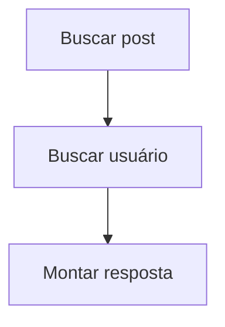
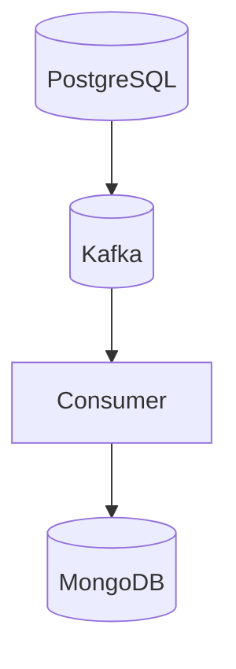

# MongoDB Read Model

Este documento descreve a estratégia de read model utilizada no projeto, a motivação para utilização do MongoDB e como os documentos são materializados a partir dos eventos CDC.

---

# Objetivo

O MongoDB é utilizado como banco de leitura otimizado da aplicação.

Seu papel é:

- servir o feed da rede social
- armazenar documentos enriquecidos
- evitar joins em tempo real
- desacoplar leitura do banco transacional

---

# Motivação

O PostgreSQL é excelente para:

- integridade relacional
- consistência transacional
- persistência oficial

Porém, consultas de feed normalmente exigem:

- joins
- agregações
- ordenações
- alto volume de leitura

Esse tipo de consulta pode impactar o banco transacional.

---

# Estratégia adotada

O projeto utiliza uma abordagem inspirada em:

```text
CQRS (Command Query Responsibility Segregation)
```

---

# Separação de responsabilidades

| Banco | Responsabilidade |
|---|---|
| PostgreSQL | write model |
| MongoDB | read model |

---

# Fluxo de materialização



---

# Coleções utilizadas

| Coleção | Objetivo |
|---|---|
| users | usuários sincronizados |
| feed_posts | feed materializado |

---

# Estrutura do feed

A coleção:

```text
feed_posts
```

armazena documentos prontos para leitura.

---

# Exemplo de documento

```json
{
  "_id": 1,
  "guid": "post-guid",
  "content": "Meu primeiro post",
  "user": {
    "guid": "user-guid",
    "nome": "Felipe"
  }
}
```

---

# Enrichment

O posts_consumer realiza enrichment consultando a coleção de usuários.

---

# Objetivo do enrichment

Evitar joins em tempo de leitura.

---

# Sem enrichment

A API precisaria:



---

# Com enrichment

A API apenas retorna:

```text
documento pronto
```

---

# Benefícios da abordagem

## Performance

Consultas são extremamente rápidas.

---

## Simplicidade

A rota de feed é simples.

---

## Menor acoplamento

Leituras independem do PostgreSQL.

---

## Escalabilidade

MongoDB pode escalar separadamente.

---

# Feed API

A rota:

```http
GET /feed
```

consulta diretamente o MongoDB.

---

# Exemplo de implementação

```python
posts = list(
    mongo_db["feed_posts"]
    .find({}, {"_id": 0})
    .sort("_id", -1)
    .limit(n)
)
```

---

# Estratégia de ordenação

O feed utiliza:

```python
.sort("_id", -1)
```

para retornar os posts mais recentes primeiro.

---

# Limite de paginação

A API protege a rota:

```python
n = min(max(n, 1), 50)
```

evitando requests excessivos.

---

# Consistência eventual

O MongoDB não é atualizado instantaneamente.

Fluxo:



Pode existir pequeno atraso entre:

- escrita
- disponibilidade no feed

Esse comportamento é esperado.

---

# Vantagens da consistência eventual

## Desacoplamento

Leituras independem da escrita.

---

## Escalabilidade

Pipelines podem crescer horizontalmente.

---

## Flexibilidade

Novos read models podem ser criados.

---

# Possíveis read models futuros

| Read Model | Objetivo |
|---|---|
| analytics_posts | métricas |
| trending_posts | posts populares |
| notifications | notificações |
| user_stats | estatísticas |
| search_index | busca textual |

---

# Possíveis evoluções

## Redis

Cache de feed.

---

## Elasticsearch

Busca textual e relevância.

---

## Aggregations

Métricas em tempo real.

---

## Feed personalizado

Feed baseado em usuário.

---

# Estratégia de atualização

O consumer utiliza:

```python
update_one(..., upsert=True)
```

garantindo:

- idempotência
- sincronização
- atualização incremental

---

# Tratamento de deletes

Eventos DELETE removem documentos do read model:

```python
collection.delete_one(...)
```

---

# Snapshot inicial

O Debezium pode gerar snapshot inicial da base.

Nesse caso:

```json
"op": "r"
```

Os documentos também são sincronizados.

---

# Observabilidade

O read model pode ser inspecionado via:

## Mongo Express

```text
http://localhost:8081
```

---

## MongoDB Compass

Ferramenta recomendada para análise dos documentos.

---

# Benefícios arquiteturais

## Read model especializado

O modelo é desenhado especificamente para o feed.

---

## Evita joins

Consultas são simplificadas.

---

## Escalabilidade independente

Leitura e escrita podem crescer separadamente.

---

## Event-driven architecture

MongoDB é alimentado exclusivamente via eventos CDC.

---

# Limitações atuais

O projeto não implementa:

- paginação avançada
- cursor pagination
- índices complexos
- sharding
- TTL collections
- versionamento de documentos

---

# Conclusão

A utilização do MongoDB como read model demonstra:

- materialização orientada a eventos
- separação entre leitura e escrita
- pipelines CDC modernas
- enrichment de documentos
- arquitetura desacoplada
- otimização de consultas de feed

seguindo padrões amplamente utilizados em sistemas distribuídos modernos.