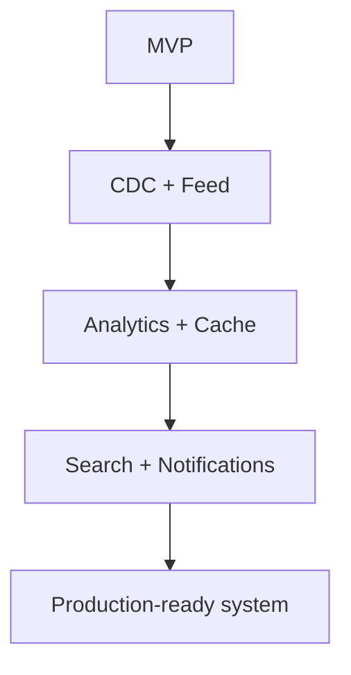

# Roadmap do Projeto

Este documento descreve a evolução planejada do projeto CDC Kafka + Debezium, incluindo melhorias arquiteturais, novas features e expansões possíveis.

---

# Objetivo

Organizar a evolução do projeto em etapas claras para:

- demonstrar maturidade arquitetural
- guiar próximas implementações
- facilitar expansão incremental
- simular evolução de sistema real

---

# Estado atual (MVP)

O projeto atualmente implementa:

- API REST com FastAPI
- PostgreSQL como write model
- CDC com Debezium
- Kafka como broker de eventos
- Consumers Python
- MongoDB como read model
- Feed básico via API
- Geração massiva de dados

---

# Próximos passos (curto prazo)

## 1. Sistema de comentários

Adicionar suporte a comentários em posts:

- tabela comments no PostgreSQL
- novo tópico Kafka
- consumer dedicado
- materialização no MongoDB

---

## 2. Sistema de likes

Implementar interação social básica:

- likes em posts
- contagem agregada
- eventos CDC

---

## 3. Feed paginado

Melhorar endpoint de feed:

- paginação por cursor
- limite configurável
- ordenação por timestamp

---

## 4. Índices no MongoDB

Otimizar performance do read model:

- index em user_id
- index em created_at
- index composto para feed

---

# Médio prazo

## 5. Analytics básico

Criar consumers de métricas:

- usuário com mais posts
- posts mais comentados
- atividade por período

---

## 6. Redis cache

Adicionar camada de cache:

- feed cacheado
- redução de carga no MongoDB
- TTL para consistência

---

## 7. Dead Letter Queue (DLQ)

Adicionar resiliência aos consumers:

- mensagens com erro vão para tópico DLQ
- reprocessamento manual

---

## 8. Retry policy

Implementar retry automático:

- backoff exponencial
- reprocessamento de falhas temporárias

---

## 9. Observabilidade

Adicionar stack de monitoramento:

- Prometheus
- Grafana
- métricas Kafka
- métricas consumers

---

# Longo prazo

## 10. Feed personalizado

Evoluir feed para:

- ordenação por relevância
- comportamento do usuário
- ranking de posts

---

## 11. Search engine

Adicionar busca textual:

- Elasticsearch
- indexação de posts
- busca por usuários

---

## 12. Notificações em tempo real

Sistema de eventos:

- novos likes
- novos comentários
- novos seguidores

---

## 13. Particionamento Kafka

Escalabilidade avançada:

- particionamento por user_id
- balanceamento de carga
- consumidores distribuídos

---

## 14. Deploy em produção

Infraestrutura cloud:

- Kubernetes
- CI/CD pipeline
- versionamento de infraestrutura

---

## 15. Autenticação e segurança

Adicionar camada de segurança:

- JWT
- refresh tokens
- controle de acesso
- roles (user/admin)

---

# Melhorias arquiteturais

## 16. Event Sourcing (opcional)

Evoluir para modelagem baseada em eventos:

- eventos imutáveis
- replay de histórico
- reconstrução de estado

---

## 17. Schema Registry

Adicionar controle de schema:

- compatibilidade de eventos
- versionamento de payloads

---

## 18. Async consumers (Python async)

Migrar consumers para:

- asyncio
- maior throughput
- menor latência

---

# Evolução da arquitetura

---

# Objetivo final do projeto

Transformar este sistema em uma simulação realista de:

> Plataforma de rede social baseada em arquitetura orientada a eventos com CDC em tempo real.

---

# Critérios de evolução

Cada nova feature deve:

- manter desacoplamento
- preservar consistência eventual
- respeitar arquitetura event-driven
- evitar acoplamento direto com PostgreSQL

---

# Conclusão

O roadmap define a evolução natural do projeto de um MVP de CDC para uma arquitetura distribuída completa, simulando sistemas reais de larga escala utilizados em ambientes de produção.