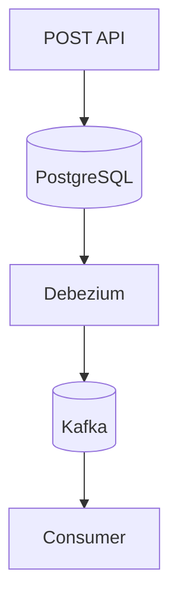

# Troubleshooting

Este documento reúne os principais problemas encontrados durante o desenvolvimento do projeto, suas causas e possíveis soluções.

---

# Objetivo

Centralizar problemas comuns relacionados a:

- Docker
- PostgreSQL
- Debezium
- Kafka
- MongoDB
- FastAPI
- Consumers

---

# Kafka sem mensagens

## Sintoma

Os tópicos aparecem no Kafdrop, porém sem mensagens.

---

## Possíveis causas

- publication inexistente
- connector mal configurado
- tabela fora da publication
- WAL lógico desabilitado

---

## Verificar publication

```sql
SELECT * FROM pg_publication_tables;
```

---

## Resultado esperado

```text
api_social_media.users
api_social_media.posts
```

---

## Solução

Criar publication:

```sql
CREATE PUBLICATION dbz_publication
FOR TABLE
    api_social_media.users,
    api_social_media.posts;
```

---

# Connector do Debezium não sobe

## Sintoma

O connector retorna erro ou não fica em RUNNING.

---

## Verificar status

```bash
curl http://localhost:8083/connectors/postgres-connector/status
```

---

## Verificar logs

```bash
docker logs kafka-connect
```

---

## Possíveis causas

- PostgreSQL indisponível
- credenciais inválidas
- publication inexistente
- plugin pgoutput ausente

---

## Verificar plugin

No connector:

```json
"plugin.name": "pgoutput"
```

---

# PostgreSQL não aceita conexão

## Sintoma

Erro:

```text
password authentication failed for user "postgres"
```

---

## Verificar variáveis do container

```yaml
environment:
  POSTGRES_USER: postgres
  POSTGRES_PASSWORD: postgres
```

---

## Solução recomendada

Resetar volumes:

```bash
docker compose down -v
```

e subir novamente:

```bash
docker compose up -d
```

---

# pgAdmin não conecta

## Configuração correta

| Campo | Valor |
|---|---|
| Host | localhost |
| Port | 5432 |
| User | postgres |
| Password | postgres |
| Database | postgres |

---

# Mongo Express cai frequentemente

## Sintoma

O container do Mongo Express reinicia sozinho.

---

## Possíveis causas

- MongoDB ainda não está saudável
- ausência de healthcheck
- pouca memória no Docker Desktop

---

## Solução

Adicionar healthcheck:

```yaml
healthcheck:
  test: echo 'db.runCommand("ping").ok' | mongosh localhost:27017/test --quiet
```

---

## Reiniciar serviço

```bash
docker restart mongo-express
```

---

# Mongo Express sem coleções

## Sintoma

Somente aparecem:

```text
admin
config
local
```

---

## Possíveis causas

- consumers não rodando
- mensagens não chegando no Kafka
- Mongo não recebeu inserts

---

## Verificar consumers

Executar:

```bash
python consumers/users_consumer.py
```

```bash
python consumers/posts_consumer.py
```

---

# Consumer recebendo NoneType

## Sintoma

Erro:

```text
NoneType has no attribute decode
```

---

## Causa

O Debezium pode emitir tombstones:

```json
null
```

---

## Solução

Adicionar validação:

```python
value_deserializer=lambda x:
    json.loads(x.decode("utf-8")) if x else None
```

---

## E também:

```python
if payload is None:
    continue
```

---

# FastAPI não atualiza automaticamente

## Sintoma

Novas rotas não aparecem sem reiniciar aplicação.

---

## Solução

Executar:

```bash
uvicorn app.main:app --reload --reload-dir app
```

---

# Porta já alocada

## Sintoma

Erro:

```text
Bind for 0.0.0.0:5432 failed
```

---

## Causa

Outra instância já utiliza a porta.

---

## Verificar processo

Windows:

```bash
netstat -ano | findstr :5432
```

---

## Soluções

### Encerrar processo

ou

### Alterar porta

```yaml
ports:
  - "5433:5432"
```

---

# Connector criado mas sem task

## Sintoma

Connector existe, porém sem processamento.

---

## Verificar status

```bash
curl http://localhost:8083/connectors/postgres-connector/status
```

---

## Solução

Recriar connector:

```bash
curl -X DELETE http://localhost:8083/connectors/postgres-connector
```

---

# Como deletar connector

## Comando

```bash
curl -X DELETE http://localhost:8083/connectors/postgres-connector
```

---

# Kafdrop sem mensagens

## Possíveis causas

- tópico vazio
- connector parado
- publication ausente
- insert não realizado

---

## Validar fluxo



---

# MongoDB sem atualização

## Possíveis causas

- consumer parado
- erro no consumer
- enrichment falhando

---

## Verificar logs

```bash
python consumers/posts_consumer.py
```

---

# Docker Desktop lento

## Sintoma

Kafka e Mongo ficam instáveis.

---

## Recomendação mínima

| Recurso | Valor |
|---|---|
| RAM | 6GB |
| CPU | 4 cores |

---

# Reset completo do ambiente

## Derrubar containers

```bash
docker compose down
```

---

## Remover volumes

```bash
docker compose down -v
```

---

## Subir novamente

```bash
docker compose up -d
```

---

# Limpar connector

```bash
curl -X DELETE http://localhost:8083/connectors/postgres-connector
```

---

# Validar Kafka Connect

```bash
curl http://localhost:8083/connectors
```

---

# Validar tópicos Kafka

Acessar:

```text
http://localhost:9000
```

---

# Validar MongoDB

Acessar:

```text
http://localhost:8081
```

---

# Logs úteis

## Kafka Connect

```bash
docker logs kafka-connect
```

---

## Kafka

```bash
docker logs kafka
```

---

## PostgreSQL

```bash
docker logs postgres
```

---

## MongoDB

```bash
docker logs mongodb
```

---

# Conclusão

A maior parte dos problemas encontrados no projeto está relacionada a:

- configuração do PostgreSQL
- publication CDC
- sincronização entre containers
- processamento assíncrono
- timing de inicialização

Este documento centraliza as soluções mais comuns para facilitar manutenção e troubleshooting do ambiente.